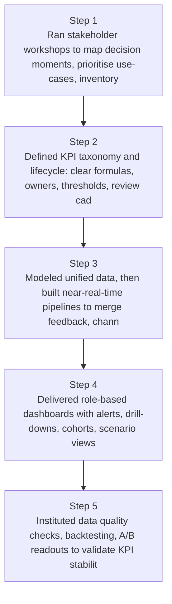
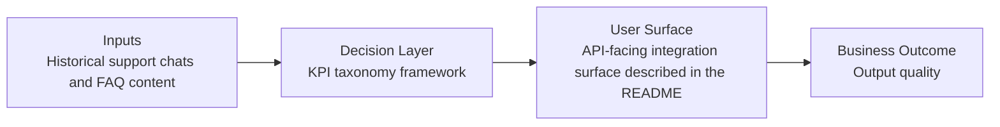
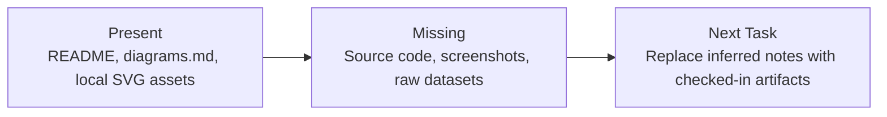

# Real-Time Marketing Decision Engine Diagrams

Generated on 2026-04-26T04:29:37Z from README narrative plus project blueprint requirements.

## Real-time data pipeline architecture

## KPI taxonomy framework

## Evidence Gap Map

